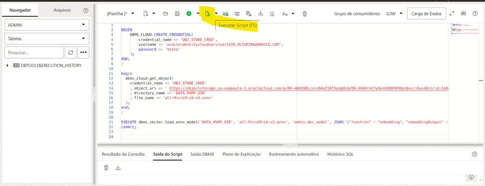
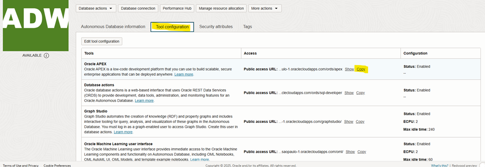
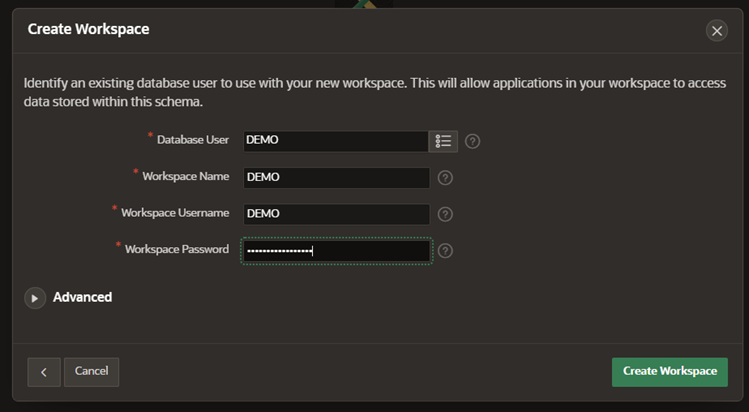
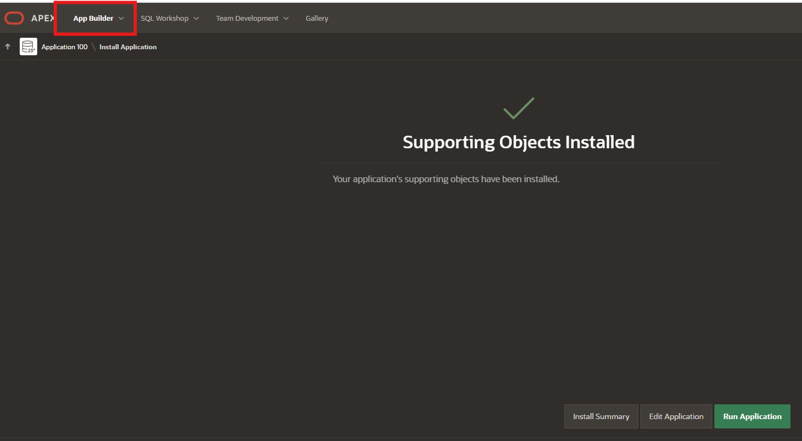
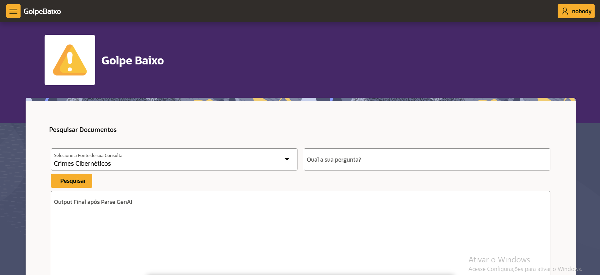

[ORACLE_BADGE]:https://img.shields.io/badge/Oracle-F80000?style=for-the-badge&logo=oracle&logoColor=black

# Golpe Baixo 🤖

![Oracle][ORACLE_BADGE]

## O que é?🧐
A Golpe Baixo é uma Inteligência arificial do tipo Rag que serve para disponibilizar informações sobre golpes cibernéticos, com você podendo a perguntar sobre esses tipos de golpes, como acontecem, como se previnir e o que fazer após ser vítima de um deles, se interessou?, por que não testar nossa IA.

## Por que ela foi criada?🤓
Ela dá uma alternativa para pessoas que querem se previnir ou saber mais sobre esses golpes de uma maneira mais rápida, esse projeto foi criado em uma no curso Discover AI da Oracle em conjunto com o Instituto Proa.

## Quais tecnologias foram usadas para a criação dela?💻
Ferramenta Oracle Apex.

## O que é um RAG?
Rag(Retrieval-Augmented Generation), é uma técnica utilizada para melhorar módelos de IA generativa, fazendo que invés de usar apenas o que foi aprendido ou buscado na internet, ela consulte uma base de dados relevante e confiável, como por exemplo a nossa pesquisa.json, fazendo que a resposta da nossa IA venha mais Coesa e diminuindo a probabilidade de alucinações.

## Como posso executar a Golpe Baixo?

Primeiramente baixo o arquivo golpeBaixo.sql que está nesse reposítorio

### criando
Segundamente entre na [Oracle Cloud Infrastructure (OCI)](https://www.oracle.com/br/cloud/), e coloque sua localidade em Chicago como na imagem abaixo:


depois vá no menu lateral e clique em Oracle database e escolha Autonomous Databases


nessa página você criará o o Autonomous Databases, mantendo tudo padrão e escolhendo sua senha, mas tem uma parte muito **importante!** que é alterar a versão do database para 23ai, se criar em outra o projeto não dará certo


após isso pode cria-lo, e aguardar até o icône ficar verde.

### configurando

Clique no ícone chamado database actions e selecione SQL, caso seja requisitado, o usuário é admin e a senha é a que você escolheu na etapa anterior, feche todos os tutoriais da tela e cole esse comando, depois execute: 


```bash
--Criação de credencial
BEGIN
    DBMS_CLOUD.CREATE_CREDENTIAL(
        credential_name => 'OBJ_STORE_CRED',
        username => 'oracleidentitycloudservice/CAIO.OLIVEIRA@ORACLE.COM',
        password => 'teste'
    );
END;
/

--Download de Modelo onnx do object storage para diretorio autonomous
begin
dbms_cloud.get_object(
    credential_name => 'OBJ_STORE_CRED'
    , object_uri => 'https://objectstorage.sa-saopaulo-1.oraclecloud.com/p/nS9blF5U2ETiZT7YKZ_zrXtPOEH2Xf22TbdlpK99xZIEPmZedx4_eFBX4khYykmw/n/idi1o0a010nx/b/TDC/o/intfloatmodelsmall.onnx'
    , directory_name => 'DATA_PUMP_DIR'
    , file_name => 'intfloatmodelsmall.onnx'
);
end;
/

--Criação de usuário/schema para import do modelo e criação da aplicação
create user demo identified by "WORKSHOPsec2019##";
grant dwrole to demo;
grant unlimited tablespace to demo;
grant read, write on directory data_pump_dir to demo;

--Import de modelo onnx para autonomous
EXECUTE dbms_vector.load_onnx_model('DATA_PUMP_DIR', 'intfloatmodelsmall.onnx', 'demo.doc_model', JSON('{"function" : "embedding", "embeddingOutput" : "embedding" , "input": {"input": ["DATA"]}}'));
commit;
```

para executar direito aperte nesse botão grafado de amarelo:



### indo ao Oracle Apex

volte a página Autonomous Database e localize e clique na opção **Tool configurate:** 



você vai encontrar a URL da instância APEX, copie e cole ela no seu navegador

na página aberta coloque a senha que você escolheu lá no começo, essa senha será sua melhor amiga

Em seguida, clique na opção Create Workspace. Na tela seguinte, escolha a opção Existing Schema para continuar com a criação do workspace utilizando um schema já existente.


preencha o formulario como está descrito abaixo e com a senha que você criou



Clique na aba superior Manage Instance e, em seguida, selecione Security, e após isso altere o parâmetro Allow Public File Upload para Yes e clique em Apply Changes para salvar as alterações.


após isso vá no canto superior direito em ADMIN e saia da sua conta dando Sign Out

e logue em demo


### logado em Demo

clique em APP Builder e importe o Arquivo golpeBaixo.sql 


e após isso você pode ir dando next e install em todas as opções daqui pra frente até chegar nessa tela



após isso você pode ir novamente em APP Builder e rodar a aplicação


e após ela abrir você pode começar a fazer as perguntas e testar nossa aplicação:



### créditos
Praticamente todo esse material foi feito com ajuda da Oracle e do [Caio Oliveira](https://www.linkedin.com/in/caio-augusto-oliveira/), sem ele eu não teria feito essa aplicação e nem subido no Github, obrigado Caio, então cliquem no nome dele para acessar o Linkedin do Próprio, esse máterial de como executar minha aplicação também pode ser usado para criar sua própria, só está adaptada por mim para você testar a minha IA, obrigado por estar lendo esse material, caso queira entrar em contato comigo aqui está meu [linkedin](https://www.linkedin.com/in/carlosbonfim26/).

# Colaboradores 
esse é o time que criou a Golpe Baixo, sem a ajuda delas esse projeto não teria sido completo, então acompanhe elas no github e linkedin que está linkado no nome delas

<div style="display:grid; grid-template-columns: repeat(4, 1fr);">
<div style="display:flex; flex-direction:column;"><a href="https://www.linkedin.com/in/carlosbonfim26/" target="_blank">Carlos Bonfim</a></div>
<div style="display:flex; flex-direction:column;"><a href="https://www.linkedin.com/in/lisandracunha/" target="_blank">Lisandra Cunha</a></div>
<div style="display:flex; flex-direction:column;"><a href="https://www.linkedin.com/in/anactavaresbrand/" target="_blank">Ana Tavares</a></div>
<div style="display:flex; flex-direction:column;"><a href="https://www.linkedin.com/in/emilygonzaga/" target="_blank">Emily Gonzaga</a></div>
</div>